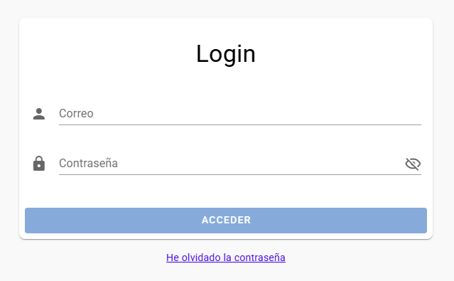
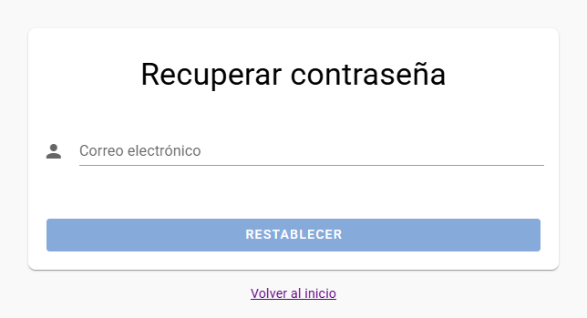
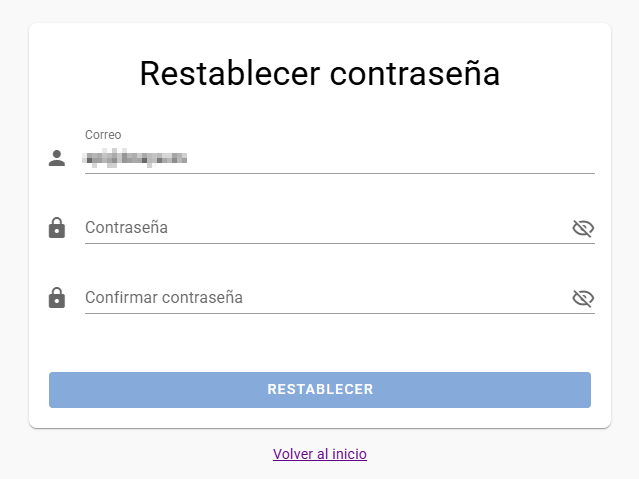

# 🔐 Autenticación

Este apartado describe el proceso de autenticación para ingresar a la aplicación, así como la recuperación y restablecimiento de contraseña en caso de olvido.

---

## 🚪 Inicio de Sesión

Para acceder a la aplicación:

1. Introduce tu **correo electrónico** en el campo correspondiente.
2. Introduce tu **contraseña**.
3. Haz clic en el botón **"ACCEDER"**.

> Si los datos son correctos, serás redirigido al panel principal de la aplicación.

Si olvidaste tu contraseña, haz clic en el enlace **"He olvidado la contraseña"** ubicado debajo del botón de acceso.

---

## 🔁 Recuperar Contraseña

1. En la pantalla de recuperación, introduce tu **correo electrónico registrado**.
2. Haz clic en el botón **"RESTABLECER"**.

Si el correo está registrado, se enviará un email con instrucciones para restablecer tu contraseña.

> ⚠️ **Nota:** Por motivos de seguridad, si el correo no está registrado, no se mostrará ningún error visible ni se enviará ningún correo.

---

## 🔑 Establecer Nueva Contraseña

El enlace recibido por correo incluye un enlace que redirige a una pantalla para establecer tu nueva contraseña.

1. Verifica que tu correo esté correcto.
2. Introduce tu **nueva contraseña**.
3. Confirma la nueva contraseña.
4. Haz clic en **"RESTABLECER"**.

Una vez hecho esto, podrás volver a iniciar sesión con tu nueva contraseña.

---

## 🔙 Volver al inicio

En cualquier momento puedes hacer clic en el enlace **"Volver al inicio"** para regresar a la pantalla de login.
