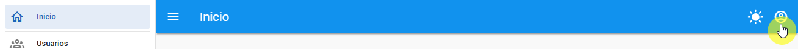
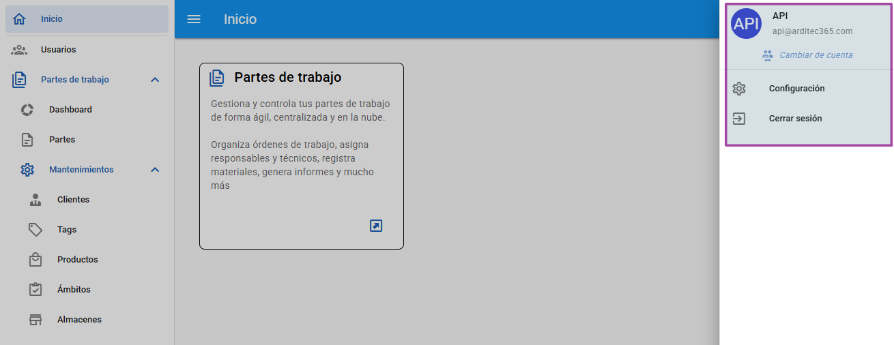
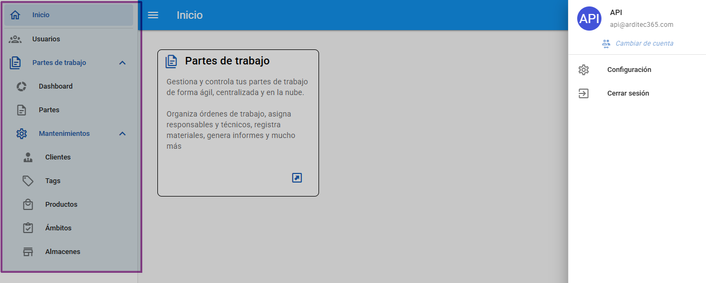

# Navegación

La interfaz de la aplicación se divide en dos áreas de navegación principales: el menú de la aplicación en la parte izquierda y la navegación de usuario en la esquina superior derecha.

---

### Navegación de Usuario

Se accede desde el icono de usuario ubicado en la esquina superior derecha, esta sección te permite gestionar tu sesión y tu perfil.

Aquí se muestran las siguientes opciones:

- **Información de usuario**: Muestra el correo electrónico del usuario que ha iniciado la sesión actual.
- **Cambiar de cuenta**: Esta utilidad aprovecha el gestor de contraseñas de tu navegador. Si tienes más de una credencial de la aplicación guardada, te permitirá seleccionar otra cuenta e iniciar sesión directamente, sin necesidad de cerrar la sesión actual y volver a introducir las credenciales manualmente.
- **Configuración**: `⏳ Próximamente`. Esta sección albergará opciones de configuración de tu cuenta en futuras actualizaciones.
- **Cerrar sesión**: Cierra la sesión activa y te redirige a la pantalla de inicio de sesión.

---

### ☰ Menú de la Aplicación

El menú principal, situado en la barra lateral izquierda, organiza todas las funcionalidades de la aplicación en tres grandes bloques.

#### 🏠 Inicio

Es la pantalla principal al entrar en la aplicación. Aquí encontrarás los accesos directos a los módulos que tu usuario tiene contratados y a los que tiene permiso de acceso.

Actualmente, el único módulo disponible es el de **Partes de trabajo**.

#### 👥 Usuarios

> ⚠️ **Nota**: Esta sección solo es visible para usuarios con rol de **Administrador**.

Desde aquí se puede realizar una gestión integral de los usuarios de la organización:

- Crear nuevos usuarios.
- Eliminar o desactivar usuarios antiguos.
- Asignar o retirar licencias de los diferentes módulos.
- Forzar el restablecimiento de contraseña para un usuario.

#### 🧩 Módulos

Esta sección agrupa todos los módulos contratados y que el usuario tenga asignados. Cada módulo tiene su propio submenú con sus funcionalidades específicas.

> ℹ️ **Nota**: Los detalles de cada apartado se explicarán en su sección correspondiente..

##### Módulo: Partes de Trabajo

Este es el primer módulo disponible en la aplicación y su menú se divide en:

- **Dashboard**: `En construcción`. Próximamente, en esta pantalla podrás visualizar gráficos y datos relevantes para un análisis rápido sobre la gestión de los partes de trabajo.
- **Partes**: El núcleo del módulo. Desde aquí podrás crear, editar, buscar y gestionar todos los partes de trabajo. También podrás realizar acciones como imputar horas, añadir materiales, registrar gastos y generar los informes en formato PDF para descargarlos o enviarlos por correo.
- **Mantenimientos**: Esta es la sección de configuración específica del módulo de Partes de Trabajo. Permite gestionar las entidades necesarias para operar:
  - **Clientes**: Gestión de la cartera de clientes.
  - **Tags (Etiquetas)**: Creación de etiquetas para categorizar y filtrar partes.
  - **Productos**: Gestión de productos o servicios utilizados en los partes.
  - **Ámbitos**: Definición de los diferentes ámbitos o tipos de trabajo.
  - **Almacenes**: Gestión de los almacenes de material.
