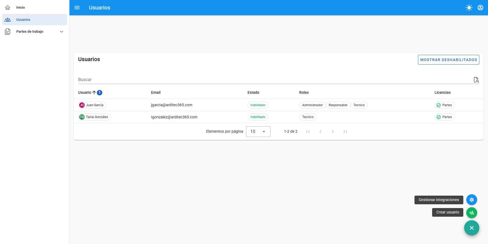
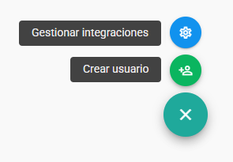
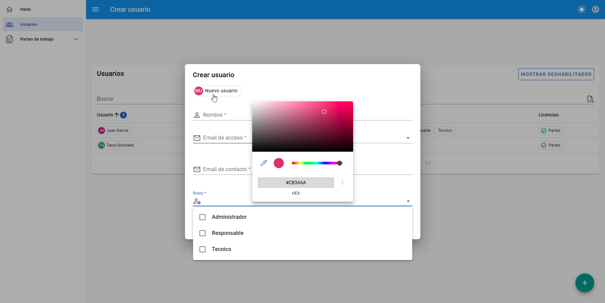
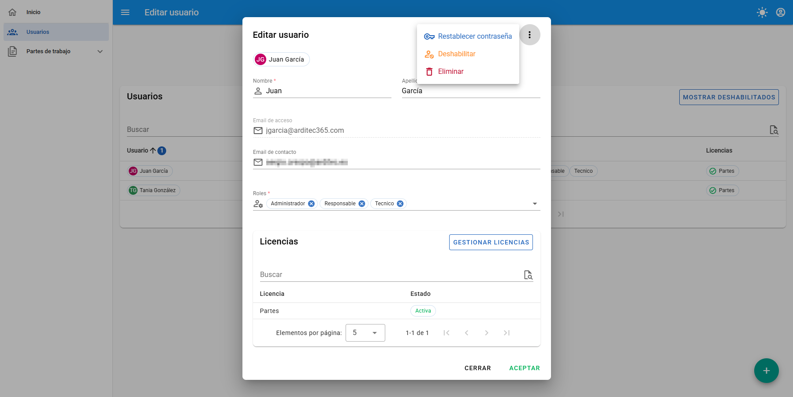
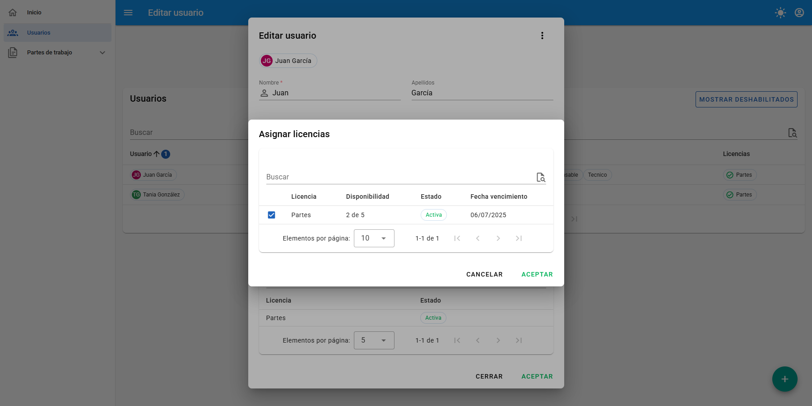
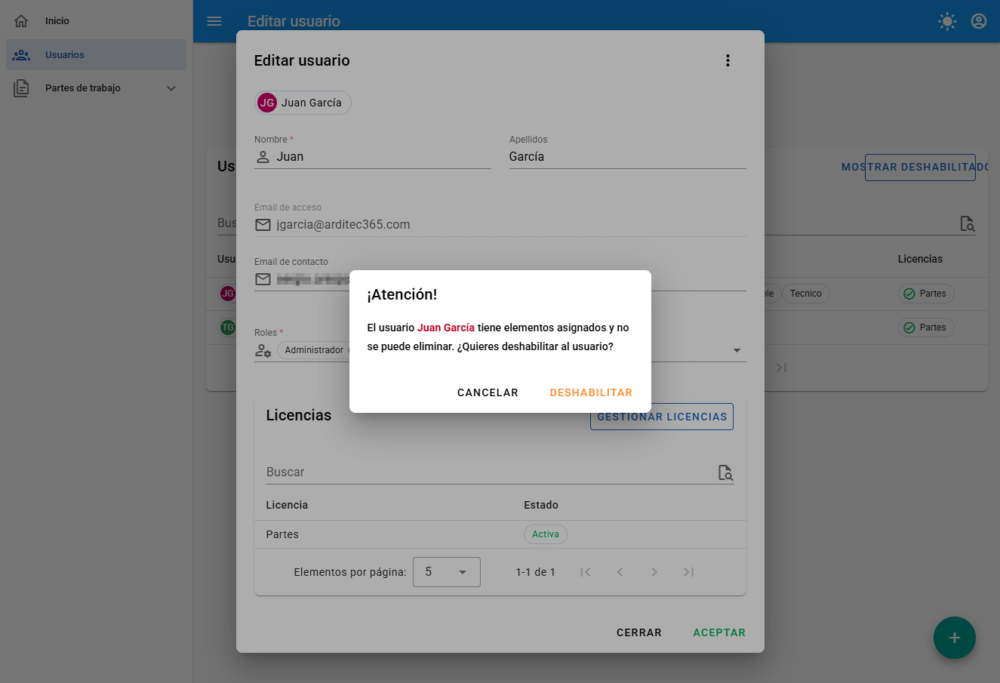
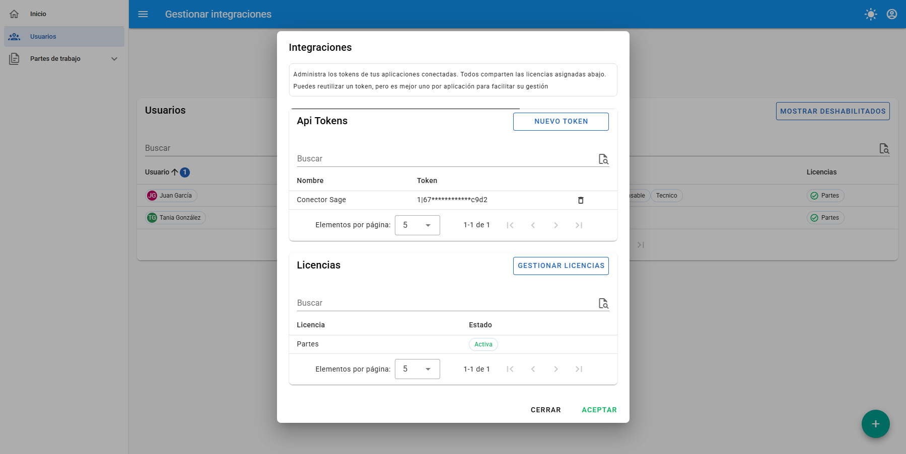
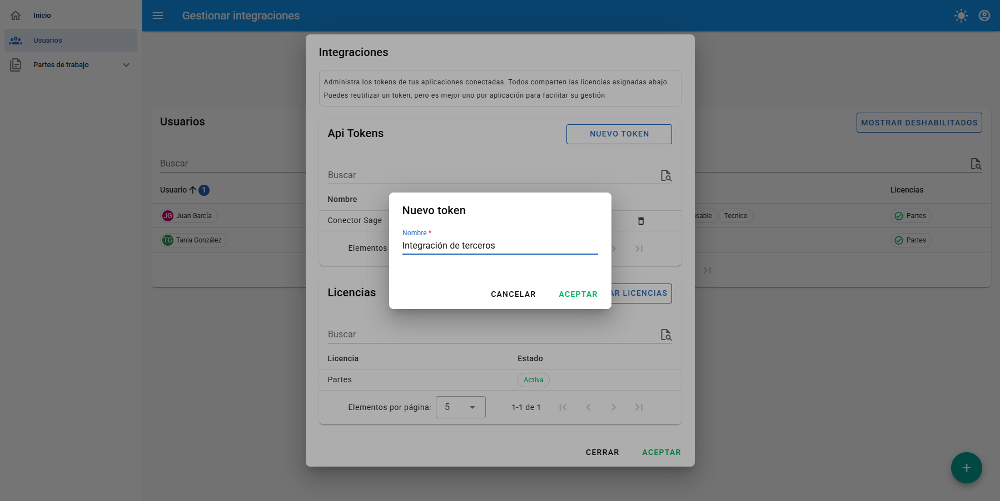
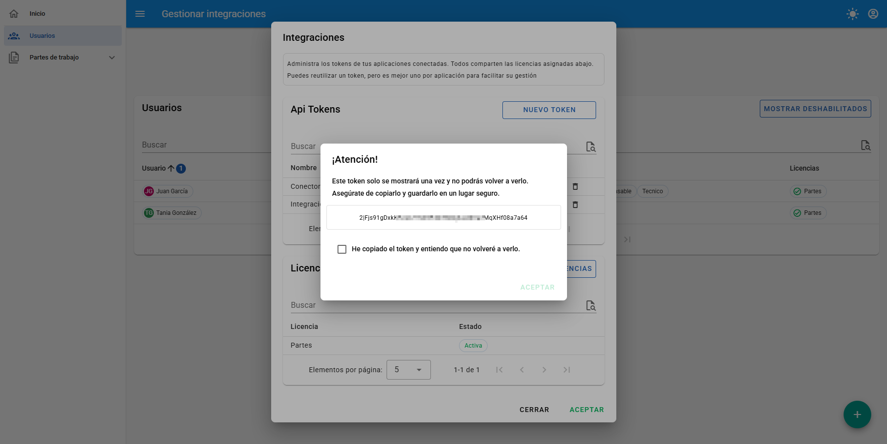
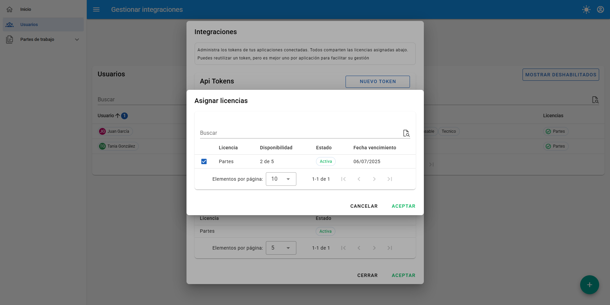

## 👥 Usuarios

Esta sección, visible únicamente para **Administradores**, es el centro de control para toda la gestión de accesos, licencias y permisos de la aplicación.

Desde la pantalla principal, se puede visualizar un listado con todos los usuarios activos.

Las principales funcionalidades de esta pantalla son:

- **Buscador**: Permite filtrar el listado de usuarios buscando por cualquiera de los campos visibles (nombre, email, rol, etc.).
- **Mostrar deshabilitados**: Este botón alterna la visibilidad de los usuarios que han sido deshabilitados, los cuales están ocultos por defecto.
- **Botón de Acciones Flotante (+)**: Ubicado en la esquina inferior derecha, despliega dos opciones clave:
  - **Crear usuario**: Inicia el proceso para dar de alta a una nueva persona en el sistema.
  - **Gestionar integraciones**: Permite crear y administrar tokens de API para conectar aplicaciones de terceros.

---

### ➕ Crear un nuevo usuario

Para añadir un nuevo usuario, se debe pulsar en el botón flotante (+) y seleccionar **Crear usuario**.

Se abrirá un formulario para que se introduzca la información necesaria.

Campos a rellenar:

- **Avatar**: Haciendo clic en el círculo con las iniciales (`NU`), se puede seleccionar un color personalizado para el avatar del usuario.
- **Nombre** (`*`): Nombre de pila del usuario. (Obligatorio)
- **Apellidos**: Apellidos del usuario. (Opcional)
- **Email de acceso** (`*`): Es el email que el usuario utilizará para iniciar sesión. **Nota**: Este email no necesita ser una cuenta de correo real, pero sí debe pertenecer al dominio de la organización (ej: `usuario@su-empresa.com`). (Obligatorio)
- **Email de contacto**: Es la dirección de correo real del usuario a la que llegarán las notificaciones (ej: restablecimiento de contraseña). Por defecto, se copia el valor del "Email de acceso", pero se puede modificar para dar de alta a usuarios con correos externos (ej: `@gmail.com`).
- **Roles** (`*`): Define los permisos del usuario en la aplicación. Se pueden seleccionar uno o más roles:
  - `Administrador`: Acceso total a todas las funcionalidades, incluida la gestión de usuarios.
  - `Responsable`: Permisos intermedios.
  - `Técnico`: Permisos básicos orientados a la operación.

Al pulsar **Aceptar**, el usuario será creado y se será redirigido automáticamente a la pantalla de edición para finalizar su configuración, como la asignación de licencias.

---

### ✍️ Editar un usuario

Para modificar un usuario existente, simplemente se debe hacer clic sobre él en el listado principal. Esto abrirá la pantalla **Editar usuario**.

Desde aquí se puede cambiar cualquier dato del usuario, **excepto el "Email de acceso"**. Si este email es incorrecto, se deberá eliminar el usuario y crearlo de nuevo.

Además de editar los campos, se tienen las siguientes acciones disponibles:

#### Gestionar Licencias

Se debe pulsar el botón **Gestionar licencias** para asignar o retirar licencias de los módulos contratados. Cada licencia permite al usuario acceder a un módulo específico (ej: Partes de trabajo).

#### Otras Acciones (Menú de Opciones)

En la esquina superior derecha del formulario de edición, el menú de tres puntos (`⋮`) da acceso a funciones críticas:

- **Restablecer contraseña**: Envía un correo de restablecimiento de contraseña al email de contacto del usuario. Esto es útil si el usuario ha perdido el acceso a su cuenta.
  > ⚠️ **Importante**: Al realizar esta acción, se cancelan las sesiones activas de ese usuario y se le modifica la contraseña por una temporal hasta que complete el proceso de restablecimiento.
- **Deshabilitar**: Desactiva la cuenta del usuario, impidiendo su inicio de sesión, pero conservando todos sus datos y su historial en la aplicación.
- **Eliminar**: Borra permanentemente al usuario.
  > ⚠️ **Importante**: La aplicación no permitirá eliminar un usuario que ya tenga actividad registrada (como partes de trabajo creados). En estos casos, la única opción es **deshabilitarlo**. La propia aplicación notificará si la eliminación no es posible.

---

### 🔗 Gestionar Integraciones (API Tokens)

Esta potente función permite crear tokens de acceso para que aplicaciones de terceros (como un ERP o un sistema de BI) puedan conectarse a su cuenta y operar a través de la API.

> 🚨 **Atención**: Un token de API actúa como un usuario con permisos de **Administrador**. Se debe tratar con la misma seguridad que una contraseña de administrador.

Para empezar, se debe pulsar en el botón flotante (+) y seleccionar **Gestionar integraciones**.

En el panel que se abre, se podrán ver los tokens ya creados, y las licencias asignadas al usuario de integración.

#### 1. Crear un Token

- Se debe pulsar en **NUEVO TOKEN**.
- Asignarle un nombre descriptivo para identificar su propósito (ej: "Conector Sage", "Integración PowerBI").

- Al aceptar, se generará el token.

> 🔐 **¡Copie y guarde su token!** El token solo se mostrará **una única vez** por seguridad. Asegúrese de copiarlo y guardarlo en un lugar seguro antes de cerrar esta ventana. No se podrá volver a visualizarlo.

#### 2. Asignar Licencias al Token

Al igual que un usuario, un token de API necesita licencias para poder acceder a los datos de los módulos.

- En el panel de "Gestionar integraciones", se debe pulsar en **GESTIONAR LICENCIAS**.
- Seleccionar los módulos a los que esta integración podrá acceder.

#### 3. Eliminar un Token

Para revocar el acceso de una integración, simplemente se debe pulsar el icono de la papelera (🗑️) junto al token que se desea eliminar.

---

> 💡 **Nota sobre las Licencias**
>
> Tanto los usuarios como los tokens de integración consumen licencias para cada módulo que utilizan. Si se necesita adquirir más licencias, por favor, contacte con nuestro equipo comercial a través del correo electrónico: **comercial@arditec.es**.
